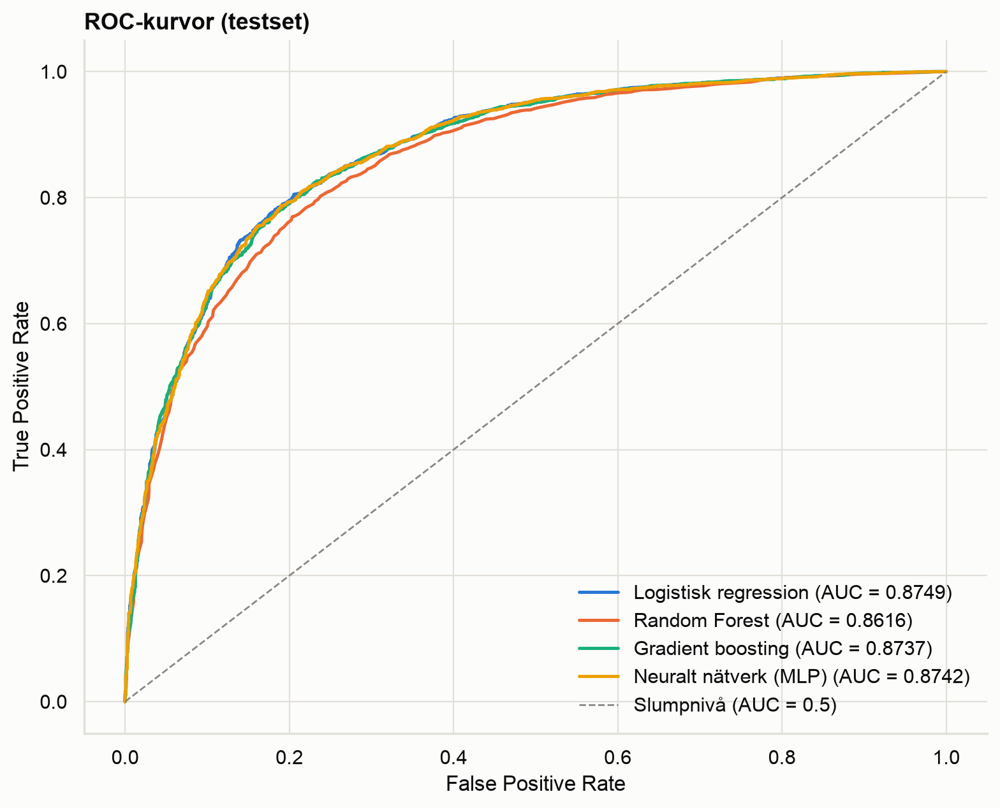
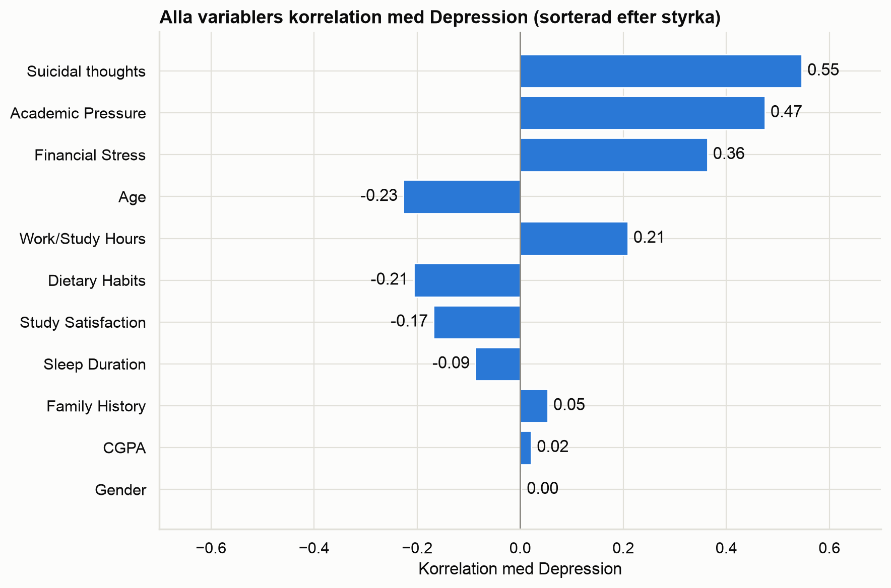

# Går det att förutsäga depression hos studenter?

Ett maskininlärningsprojekt som undersöker vilka livsstils- och studiefaktorer som hänger
ihop med depression hos studenter – och hur långt de räcker för att förutsäga den.

Projektet går från rådata till färdig modell och jämför unsupervised learning, klassisk
supervised learning och deep learning. Av fyra modeller valdes **logistisk regression, med
test-AUC 0.8749, accuracy 80.0 % och recall 85.1 %**. Till projektet hör också en
**Streamlit-app** som räknar ut hur sannolikt det är att en student är deprimerad, utifrån en
profil du ställer in.

Ett val påverkar hela projektet: datasetets starkaste variabel, frågan om självmordstankar, är
**utesluten**. Den är ett symptom på depression, inte något som kommer före den. Se
[Analysdokumentationen](docs/analys.md) för resonemanget.

---

## Resultat

Alla siffror är mätta på ett testset som modellerna aldrig såg under träningen (5 569 studenter).

| Modell | Accuracy | Precision | Recall | F1 | AUC-ROC (test) |
|---|---:|---:|---:|---:|---:|
| Chansa på majoriteten (baslinje)\* | 58.6 % | – | – | – | 0.500 |
| Random Forest | 78.6 % | 0.803 | 0.842 | 0.822 | 0.8616 |
| Gradient boosting | 79.7 % | 0.812 | 0.851 | 0.831 | 0.8737 |
| Neuralt nätverk (MLP) | 80.1 % | 0.825 | 0.837 | 0.831 | 0.8742 |
| **Logistisk regression** *(vald)* | **80.0 %** | 0.816 | 0.851 | 0.833 | **0.8749** |

\* Baslinjen är inte tränad. Den motsvarar att alltid gissa den vanligaste klassen, och
finns med för att visa vad 80 % är värt i sammanhanget.

Alla fyra modeller hamnar mellan AUC 0.86 och 0.87. Att den enklaste modellen är lika bra som
de mer avancerade är i sig ett resultat, och den valdes för att den är lätt att tolka.



---

## Data

[Student Depression Dataset](https://www.kaggle.com/datasets/hopesb/student-depression-dataset)
(Kaggle, hopesb). 27 901 rader och 18 kolumner i rådata; 27 842 rader och 13 kolumner efter
städning. Målvariabeln `Depression` är binär och ganska jämnt fördelad (58.6 % / 41.4 %).

Både rådatan och den städade versionen ligger i repot, så allt går att köra om från början.



---

## Projektstruktur

```text
student-depression-ML-project/
│
├── 01_Dataforberedelse.ipynb      # städning, kodning → clean.csv
├── 02_EDA.ipynb                   # utforskande analys
├── 03_Unsupervised.ipynb          # KMeans, PCA, hypotesgenerering
├── 04_Supervised.ipynb            # fyra modeller, utvärdering
│
├── app.py                         # Streamlit-app
├── export_model.py                # sparar vald modell till .joblib
├── champion_model.joblib
│
├── docs/
│   └── analys.md                  # metod, resonemang och slutsatser
│
├── images/
│   ├── korrelation_depression.png
│   └── roc_kurvor.png
│
├── Student Depression Dataset.csv # rådata
├── student_depression_clean.csv   # efter 01
├── README.md
└── requirements.txt
```

Notebooksen körs i ordning 01 → 04. `01` producerar `student_depression_clean.csv` som
resten bygger på.

---

## Kom igång

Projektet är kört på **Python 3.13**.

```bash
git clone <repo-url>
cd student-depression-ML-project

python3 -m venv venv          # Windows: python -m venv venv
source venv/bin/activate      # Windows: venv\Scripts\activate

pip install -r requirements.txt
jupyter lab
```

---

## Kör appen

```bash
streamlit run app.py
```

I appen ställer du in en studentprofil och ser vad modellen kommer fram till, tillsammans med
vilka variabler som påverkar resultatet mest. Det går just för att den valda modellen är lätt
att tolka.

Åtta färdiga profiler (A–H) varierar ålder, press/stress och sömn två och två, medan övriga
variabler ligger kvar på medianvärdet. Då går det att se en faktor i taget. Bredvid modellens
svar visas hur stor andel som faktiskt är deprimerade i samma typ av grupp i datasetet
(15.9 %–90.6 %), så att det går att se om modellen ligger rimligt till.

`export_model.py` tränar om modellen med samma features, split och seed som
`04_Supervised.ipynb` och kontrollerar att den når samma test-AUC (0.8749). Notebooken behöver
alltså inte köras om.

---

## Analys

Projektet går igenom hela ML-flödet: dataförberedelse, EDA, unsupervised learning, supervised
learning och deep learning. Kort sammanfattat:

- **Akademisk press och ekonomisk stress hänger starkast ihop med depression.** Ålder är den
  näst starkaste faktorn – 71.3 % bland 18–21-åringar, 41.0 % bland 31–35-åringar.
- **Klustringen hittade inga tydliga grupper, och det var i sig ett svar.** Studenterna ligger
  på en glidande skala där stressnivån är det som skiljer dem åt mest, inte i olika
  livsstilstyper.
- **Klustringen gav ändå en hypotes om sömn**, som testades för sig mot datan. Den stämde, men
  behövde justeras.
- **Enkla modeller räckte.** Deep learning gav ingen förbättring som gick att mäta. Det verkar
  vara informationen i datat som sätter gränsen, inte valet av modell.

För frågeställning, metodval och hela resonemanget, se
**[Analysdokumentationen](docs/analys.md)**.

---

## Teknik

Python, pandas, NumPy, Matplotlib, Seaborn, scikit-learn, TensorFlow/Keras, Streamlit,
joblib, Jupyter Notebook, Git/GitHub.
